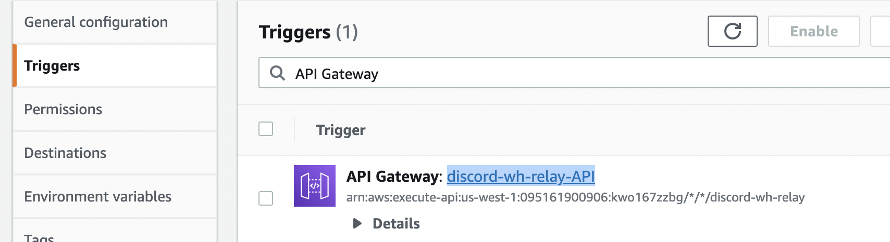
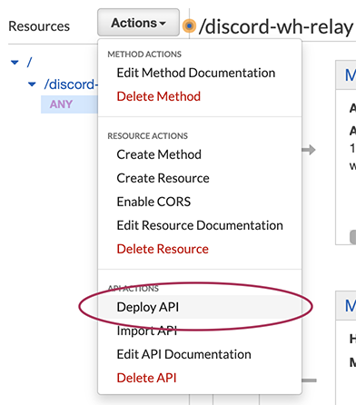
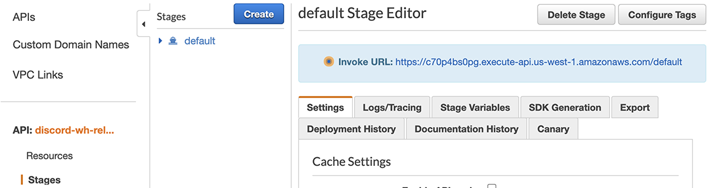
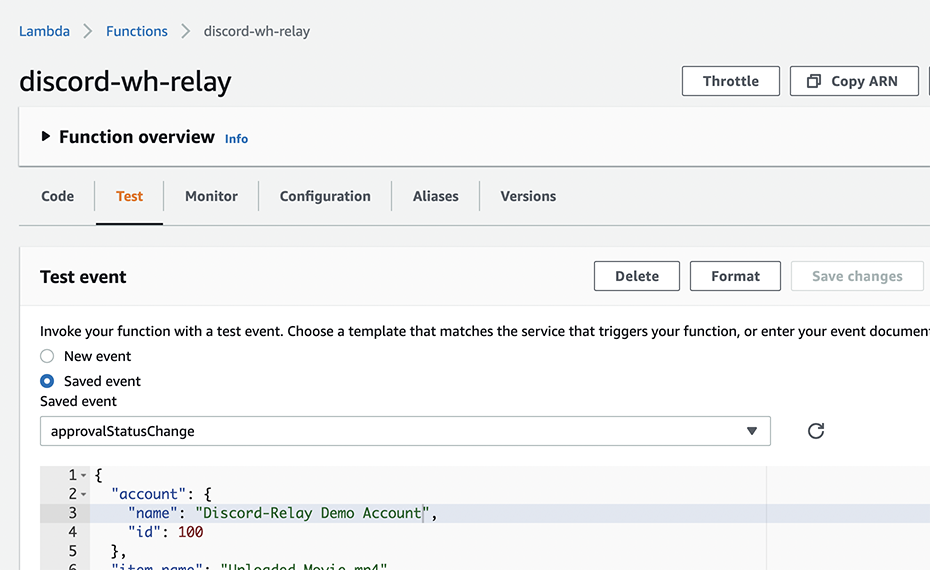

# SyncSketch Webhook Integrations Using AWS

SyncSketch has introduced support for *webhooks*, which allows users to receive notifications of various events like approval status changes or new item uploads.  These webhooks can be used to post information into a chat channel, send a text message, or any other method of the user's choosing.

> Note: Using Webhooks requires access to the SyncSketch API, which requires an Enterprise SyncSketch account.

The concept behind webhooks is very simple, and from a coding standpoint isn't difficult either.  The idea is that every time an event occurs in your SyncSketch account (an item is uploaded, the approval status changes, etc.), a message is sent to a URL that you provide.  Your job is to make a function at that URL listen for the message and do something useful with it.

The easiest way to build your listener is by using Amazon Web Services, which lets you set up a function that has a URL.  This way, you don't have to set up, administer or maintain a public-facing server.  We will be using primarily an AWS service called Lambda for the functions.

This post will discuss the required code and the AWS configuration details.  We will set up an integration with a chat application ([Discord](https://discord.com/), because it's simple and free), but the AWS configuration could be adapted to integrate it with anything that has an API, or has webhook support itself.  The actual code is simple; there isn't much to it. The main thing we have to do is set up the API on AWS.

[Discord supports incoming webhooks](https://support.discord.com/hc/en-us/articles/228383668-Intro-to-Webhooks), in the sense that you can start your own server and get a URL that will post incoming messages into a chat channel on that server. Discord expects incoming messages to be in a particular format, but SyncSketch does not currently allow users to specify the output format of its webhooks.  So in this case we are going to create an intermediary function that listens for the SyncSketch webhooks and uses the information in that message to build a new message in the right format for Discord, then sends its own webhook to Discord. (This same approach could be used to adapt SyncSketch webhooks to virtually anything else.)

[TOC]

The sequence of steps is as follows:

1. Get an AWS account
2. Set up a Discord server with a Webhook
3. Write an AWS Lambda function that posts into the Discord server
5. Set up an API gateway for SyncSketch to send messages through
6. Set up a webhook in SyncSketch

If you've never done these things before: Every one of these steps is easier than it sounds.

## Getting your AWS account
If you don't already have an account, go ahead and go to [aws.amazon.com](https://aws.amazon.com) and sign up for an account (or log in if you already have one).  This Lambda function doesn't do much so it will most likely stay in the free tier.

## Setting Up Your Discord Server
Once you have a Discord account and have [downloaded the desktop client](https://discord.com/download), setting up your own server is amazingly simple, and can be done in about two minutes.

In the desktop version of Discord:

1. Click the green icon with the plus to create a server.  


2. Choose **Create My Own**, then **For Me and My Friends**.
3. Give the new server a name.  Icon is optional.

Now that you have a server, let's set up a webhook for it.

1. Click the plus sign next to "Text Channels" and create a new text channel called "**project-notifications**"


2. Click the gear icon next to project-notifications in the list at the left.  

3. Click **Integrations** in the nav bar at the left. 


4. Click **Create Webhook**.
5. Name it "**Status Changes**".
6. Click **Copy Webhook URL**.
7. Paste the URL somewhere where you can copy it later. (If you lose it, you can still get it from Discord.)
7. Click Save Changes.

That URL is the webhook; properly-formatted messages ("requests") to that URL will add a message into the project-notifications channel. Now that you have the magic URL, let's take it to AWS.

## Writing Your Lambda Function

Back in AWS, log into the [AWS console](https://aws.amazon.com/console/).  This will present you with a dizzying list of services.  For this section, the service we're interested in is **Lambda**.  Find it on the page and open it.

Make a note of the Region you're "in".  In this example, this account is working in the AWS region "N. California (us-west-1)". A notion peculiar to AWS is that your services and functions are associated with a particular region, so if you're not in the right region (or referencing it) you will be wondering why your function is missing.

1. Click on the Functions section in the nav bar and select **Create function**.
2. Click **Author from Scratch**.
3. Give your function a name.  In this example we'll call it `discord-wh-relay`.
4. Leave everything else at the defaults and select **Create function**.  For this example, we'll be writing in JavaScript, so Node.js is appropriate.
5. The view that appears should have a **Code source** section.  A folder labeled **discord-wh-relay** will be selected, with an `index.js` file just underneath.
6. Double-click `index.js`.  This will reveal a little code template for the *handler* that will handle the incoming webhook from SyncSketch.
7. Delete the code in the template.
8. In its place, let's put in the Discord webhook URL and assign it to a variable:


Next, we'll add a dummy message for now, right where the line you just deleted was:

`const message = 'The approval status of "GroomFaintsWIP_5.mp4" in the "Wedding Scene" review has changed from **In Progress** to **Approved**';`

Paste in these lines:

```
const https = require('https');
const url = require('url');

function handler(event, ctx, cb) {
var whurl ="paste-your-discord-webhook-url-between-these-quotes";
const message = 'The approval status of "GroomFaintsWIP_5.mp4" in the "Wedding Scene" review has changed from **In Progress** to **Approved**';

// CALL THE SENDER FUNCTION HERE

}

// SENDER FUNCTION GOES HERE

exports.handler = handler;
```
Paste in the Discord webhook between the quotes of the `var whurl=` line. If you need to recover your webhook URL, see "troubleshooting" below for instructions on how to get it in SyncSketch.)


Next, we'll add the line that triggers the webhook message to be sent. This will replace the `// CALL THE SENDER FUNCTION HERE` line:

```
    webhook(message, whurl)
    .then((result) => {
        cb(null, JSON.stringify(result));
    })
    .catch(error => cb(error));
```
## Adding the Webhook Sender

Finally, we'll add the `webhook()` function that we are using to send the webhook message to Discord.  You don't need to know much about this code, except that it creates and sends its own webhook request, formatting the message that we give it into the appropriate format for Discord.  Just paste it in place of `// SENDER FUNCTION GOES HERE`:

```
function webhook(message, wh) {
    return new Promise((resolve, reject) => {
        const whurl = url.parse(wh);
        const payload = JSON.stringify({
            'username': 'SyncSketch',
            'content':  message
        });
        const options = {
            hostname: 'discordapp.com',
            headers: {'Content-type': 'application/json'},
            method: "POST",
            path: whurl.path, 
        };
        var bufferData = '';
        const req = https.request(options, (res) => {
            res.on("data", (data) => {
                bufferData += data;
            });
            res.on("end",  () => {
                let data = {message: 'Webhook message sent!'};
                if(bufferData.length) {
                    data = JSON.parse(bufferData);
                }
                if(data.code) {
                    reject(JSON.stringify({statusCode:data.code, body:data.message}));
                } else {
                    resolve({statusCode: 200, body: data.message});
                }
            });
        });

        req.on("error", (error) => {
            reject(Error(error));
        });
        req.write(payload);
        req.end();
    });
}
```
### If you want to know more:

For Discord, this bit here is the magic:

```
        const payload = JSON.stringify({
            'username': 'SyncSketch',
            'content':  message
        });
```
Discord wants a JSON object in the body containing  `username` and `content` text strings and that's it.  Everything else you see here is about building a webhook message of our own and doing some error-checking, then sending it and relaying Discord's response back.

Let's test it to see how we're doing so far.  This should be enough code to do something gratifying.  

## Creating a Test Event
Lambda functions respond to *events*.  The events we are concerned with will be approval status changes in SyncSketch.  Now we are going to create a test event that will eventually simulate a message coming from SyncSketch.  

Just above the code window is a Test button that will trigger an event.  Click the triangle next to it and choose **Configure Test Event**.


In the dialog that appears, a test event template called `hello-world` will appear, which is suitable place to start.  Rename it "**approvalStatusChange**" and for now we'll leave everything else the way it is:


Click **Create** at the bottom of the dialog.

If you click **Test** now, the code tab will be replaced with a console tab that displays unformatted text.  No message appears in Discord, and the console shows this raw response data:

```
{
  "statusCode": 200,
  "body": "\"Hello from Lambda!\""
}
```

Wait, where is that coming from?  What's going on?  The answer is that you need to *deploy* the new code before you test it.  Think of it like a Save button, or more aptly the Publish button in a blogging app.  Every time you change the code in here, you need to deploy it, so let's do that.  

Click the big orange **Deploy** button.

*Now* you can click **Test**.  If all is well, you should hear a "bloop" and your test message should appear in Discord!  An Execution Result tab will show the following response:

```
"{\"statusCode\":200,\"body\":\"Webhook message sent!\"}"
```

The **Code** tab will return you to the code.

### Troubleshooting
Computers were made to disappoint. Writing code is no exception.  Here are some troubleshooting tips if you're not seeing the Discord message when you click Test.

### Nothing posts to Discord
If everything seems OK and you're getting a status code of 200 back but nothing is appearing in Discord, the problem is surely in the webhook URL in the `path` variable.  Go back into Discord and open the settings gear next to your server's "project-notifications" channel. Click **Integrations**, then **View Webhooks**. Select your "Status Changes" webhook and click **Copy Webhook URL**.  Paste it between the double-quotes after `path=`.

### Getting errors that suggest a problem with my code
If you're getting JavaScript errors, rebuild your JavaScript as follows:

Delete all of the code from `index.js`. Copy these first lines and paste them in:

	const https = require('https');
	const url = require('url');
	
	function handler(event, ctx, cb) {
	    const whurl = "https://discord.com/api/webhooks/825812896431996938/og_Gr7e84y54iuFPU24Coqwgxsw7On1SmQbCFYB__GC9Pj-Q4UlZqBBpmb88MIB19iHf";
	    const message = JSON.stringify(`The approval status of **GroomFaintsWIP_5.mp4** in the **Wedding Scene** review has changed from **In Progress** to **Approved**`);  
	    webhook(message, whurl)
	    .then((result) => {
	        cb(null, JSON.stringify(result));
	    })
	    .catch(error => cb(error));
	}
	exports.handler = handler;

3. Then after those lines, append the lines from the "Add the Webhook Sender" section above.
4. Finally, replace the Discord webhook URL in the example with your own, according to the procedure described in the "Nothing posts to Discord" solution above. 

## Creating the API Gateway

Message traffic coming into a Lambda function like this one generally must come through an *API Gateway*, so let's add one.

Scroll to the top of your function's page and click the **Add Trigger** button. 


From the dropdown in the following dialog, select **API Gateway**.


For the trigger configuration we will create an *open REST API*:


1. Leave **Create an API** selected.
2. Choose the **REST API** box
3. Under **Security**, select **Open**
4. Click **Add**

By default the name will be `discord-wh-relay-API`:  



In the **Triggers** section, click the linked name to configure it.

##Configuring the API Gateway
The new tab that appears is used to configure a new API gateway.  The good news is that the way it's set up by default will work just fine for our purposes; all we need to do is deploy it.  If there's no big **Deploy** button in the upper right, deploy it from the dropdown:



In the dialog that follows, set the **Deployment stage** to `default` and click **Deploy**.  Once deployed, the API Gateway page will now have the all-important **Invoke URL** at the top of the Stages section – this is the URL we will have SyncSketch send to.




### Testing from the Gateway

1. Click on the Resources link in the nav bar at the left.
2. Click "**ANY** under **/discord-wh-relay-API`
3. Click Test.  The following big dialog will appear.


4. Set the Method to POST, since that is the HTTP method used to send webhook messages.
5. Leave everything else the way it is and scroll to the bottom, and click **Test**.
 
The Discord bloop should sound and your dummy message should appear again in your Discord channel.  It is now available through a public API.  

### Troubleshooting

If the API gateway test fails, check the following:

* The URL for your Discord webhook is in quotes in the `path` specified in `index.js`
* You deployed your changes in the function
* Your dummy message has the correct syntax.  Pay attention to the use of single quotes and double quotes in the example
* If the images above don't look anything like what you're seeing, you may have created an HTTP API by mistake.  Delete the `discord-wh-relay-API` and try again, making sure you click REST API in the API configuration dialog.
* ...


## Writing your Webhook Listener

Now we'll get the Lambda function to handle real input.

As input, the SyncSketch webhook will send JSON in the body of the message that looks something like this, which is what is sent with the `item_approval_status_changed` event:

```
{
  "account": {
    "name": "Discord-Relay Demo Account",
    "id": 100
  },
  "item_name": "Uploaded Movie.mp4",
  "review": {
    "name": "Opening Credits Review",
    "id": 123
  },
  "item_creator": {
    "id": 1,
    "name": "Mike Jennings",
    "email": "jennings@example.com"
  },
  "new_status": "approved",
  "project": {
    "name": "Our Amazing Movie Project",
    "id": 101
  },
  "item_id": 4056789,
  "old_status": "wip"
}
```

We will pull the values from this data structure to build the message that gets posted to the chat.

In our code we defined `message` to be a dummy message.  Now let's replace the dummy text with the values that come from the webhook message.

1. Return to the Lambda tab (**Lambda > Functions > discord-wh-relay**) and click on its Code tab
2. Double-click `index.js` in the **Code source** section.
3. Where it says:
```
const message = JSON.stringify(`The approval status of **GroomFaintsWIP_5.mp4** in the **Wedding Scene** review has changed from **In Progress** to **Approved**`);
```
it should now read:
```
const message = JSON.stringify(`The approval status of **${event.item_name}** in the **${event.review.name}** review has changed from **${event.old_status}** to **${event.new_status}**`);
```

### Testing the Update

To test this, we will need to send a message that has a body. Copy the example body above and replace the body data in the `approvalStatusChange` test event.

2. Click the **Test** tab.
3. Paste the example body content from above into the text area below `approvalStatusChange`, replacing what was there by default:



3. Click the **Save Changes** button.

Now test it again by clicking **Invoke**, and verify that the body data is being formatted correctly in the Discord chat.  If this succeeds, your function is complete and working! Now all we have to do is set up the SyncSketch webhook to send messages to it.

## Creating a SyncSketch Webhook

Before we start setting up the webhook in your SyncSketch account, you need the following bits of information:
The **invoke URL** of your API Gateway

Currently there's no way to set up the webhooks in the SyncSketch web site.  But we can still do it using a command-line utility called cURL, which is most likely already installed on your system.

1. Paste the following example cURL statement into a text editor:

```
curl --location -g --request POST 'https://syncsketch.com/api/v2/notifications/{{account_id}}/webhooks/' \
--header 'Authorization: apikey {{username}}:{{apiKey}}' \
--header 'Content-Type: application/json' \
--data-raw '{
    "url": "paste-your-invoke-url-between-the-quotes",
    "type": "item_approval_status_changed"
}'
```
2. In SyncSketch, go to the **Workspace Settings** for your overall SyncSketch account (under the dropdown with your avatar in the upper right).
3. In the URL (i.e. `https://syncsketch.com/pro/#/account/78901/settings`), there will be a number, at least five digits.  This number is the account ID you can use with the API.  Make a note of it.
2.Replace the `{{account_id}}` token with your main SyncSketch Account ID.
3. Replace the `{{username}}` token with your SyncSketch administrator account's email address.
4. Replace the `{{apiKey}}` token with your SyncSketch administrator account's API key, available from the Settings tab of the Profile page.
5. Open a Terminal window or other command line utility and paste the updated version of the cURL command.

This should result in 
`{"url":"https://7bjk6m00kl.execute-api.us-east-1.amazonaws.com/default","headers":"null","type":"item_approval_status_changed","id":1}%`

### Using a GUI Tool Instead of Command-Line

If you don't care to use a command-line tool like cURL, there are many application programs like Postman and Insomnia that will help you build your API request graphically.

To use Postman:
1. Copy the updated cURL command from the previous step
2. Select File > Import
3. In the import dialog, select the "Raw text" tab.
4. Paste in the cURL command into the dialog and hit OK

Nw you can replace the default text with your sspecific details, like the URL for the API Gateway

If you send your request and receive a response code of `200`, you should be ready to go.  

## Try It!

In your SyncSketch account, load an item and change its approval status.  If all goes well: Bloop, and a new Discord message!

> TROUBLESHOOTING

## Other Events

Each event notification will have a different JSON data structure in its body.  If you require more than one notification type, you will need to determine the event type before you build the Discord message.  For this reason, we will add a little more complexity to `index.js` so that it supports multiple event types.

> WRAP THE MESSAGE BUILDER IN A SWITCH STATEMENT.   MORE MODULES?

## Other Listeners

You may prefer to receive notifications using other listeners, like Slack or SMS text message.  Here's how you might adapt the code we've made for other uses.

> SHOW AWS SNS USAGE

## Sending Custom Request Headers

You may wish to send data specific to your account along with each webhook message, such as an authentication token.  SyncSketch does not currently allow you to specify anything to be added to the body of the messages, but it does let you add custom HTTP headers in the request. Normally, Lambda only provides your handler function with body content from the message, so we will need to configure it to pass along the headers as well.

Currently we have our Discord webhook URL hard-coded in our Lambda.  This is good for security, but not so good for versatility. To illustrate the configuration details we're going to update our example listener to accept Discord webhook URLs as a custom header, in order to allow you to use this one Lambda function for any Discord server channel.

